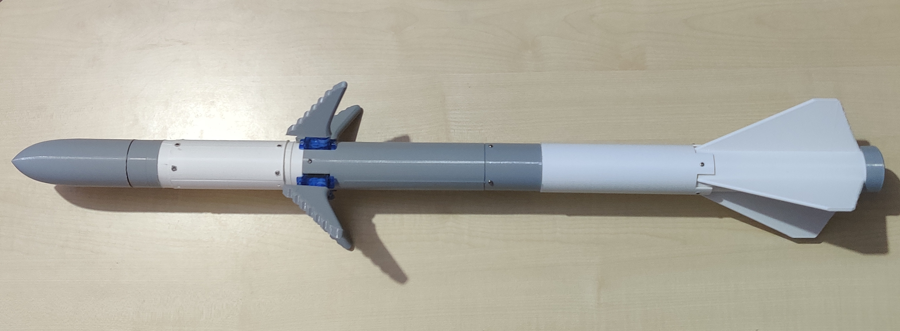

# Bio-Inspired Whale Flipper Controlled Rocket for Agile Flight Maneuvering

# TECHNICAL FIELD

The present invention generally relates to the field of aerospace engineering and aeronautics.
More particularly, the invention pertains to bio-inspired flight control systems for rockets.
Specifically, it involves the design and implementation of a fin-based rocket control mechanism inspired by the morphology and movement dynamics of whale flippers, enabling enhanced stability, agility, and maneuverability during atmospheric flight.

# OBJECTS OF THE INVENTION	

To provide a rocket control system inspired by the dynamic movement of whale flippers, enabling improved aerodynamic maneuverability during flight.

To develop an active fin-based control mechanism that allows the rocket to achieve pitch, yaw, and roll adjustments using independently actuated fins.

To mimic the leading-edge tubercle design of whale flippers for enhanced lift generation, reduced drag, and improved stall resistance.

To create a more stable, agile, and efficient rocket flight system that operates effectively under varying atmospheric conditions.

To enable fine attitude control and trajectory correction during rocket flight without relying solely on thrust vectoring.

To design a lightweight, portable, and scalable fin-actuation system suitable for small experimental rockets or future aerospace applications.

To enhance the aerodynamic efficiency of the rocket by utilizing biomimetic surface structures on the control fins.

To reduce energy consumption during flight maneuvers, allowing the rocket to conserve fuel while maintaining high agility.

To demonstrate the practical application of bio-mimicry principles in aerospace vehicle control through experimental validation.

# SUMMARY OF THE INVENTION		

The present invention discloses a bio-inspired rocket control system that uses actively controlled fins shaped and operated based on the dynamics of whale flippers. The rocket features control surfaces equipped with leading-edge tubercles, mimicking the natural design of whale flippers to enhance lift, delay aerodynamic stall, and improve maneuverability.

Unlike conventional rockets that rely solely on thrust vectoring or rigid fins, the proposed system enables fine adjustments of pitch, yaw, and roll through independently actuated fins, achieving smoother and more efficient control during atmospheric flight. This design reduces energy consumption, enhances flight stability, and allows for precise trajectory corrections. The invention demonstrates the practical application of biological principles to aerospace systems, resulting in a rocket that combines agility, stability, and aerodynamic efficiency.

# DETAILED DESCRIPTION OF THE INVENTION

In the following detailed description, the specific embodiment of the invention is explained to enable those skilled in the art to implement the invention. While various modifications may be possible, the invention is described with reference to its most effective realization.

The present invention provides a rocket with bio-inspired fin-based control surfaces, mimicking the morphology and movement of whale flippers to achieve enhanced aerodynamic performance. The fins are shaped to include leading-edge tubercles similar to those found on whale flippers, which help in increasing lift, delaying aerodynamic stall, and reducing drag during flight.

The rocket structure comprises a central fuselage, propulsion system, four independently actuated fins, a control system, and power electronics. The fins are mounted symmetrically around the rocket's body and are controlled via high-torque, high-speed servo motors capable of rapid angular adjustments.

During flight, real-time control algorithms adjust the fins’ angles based on input signals from an onboard flight controller, allowing the rocket to perform pitch, yaw, and roll maneuvers effectively. The whale-flipper-inspired fins create small vortices at the leading edge, improving airflow attachment over the surfaces and preventing early stall even at high angles of attack.

The actuation system includes sensors to monitor fin positions and flight attitude, ensuring that the fins react precisely to the control inputs. The design minimizes the dependence on thrust vectoring, thereby conserving fuel and simplifying the propulsion system.

The materials used for the fins are lightweight composites, combining flexibility and strength to allow slight bending under aerodynamic loads, further enhancing flight control. The entire system is optimized for low weight and high responsiveness, ensuring the rocket can achieve stable, agile, and energy-efficient atmospheric flight.

The invention is particularly suitable for applications requiring high maneuverability such as research rockets, re-entry vehicles, and future autonomous aerial platforms.

The foregoing description illustrates the embodiment but should not be considered limiting. Variations and improvements may be made without departing from the scope and spirit of the invention.

# CAD

|  |  |
| --------------------------- | --------------------------- |

# CFD for BIO inspired FIN's

|  |  |
| --------------------------- | --------------------------- |

CFD Simulation Explanation:

The CFD simulation shows the airflow behavior around a rocket fin. The streamlines indicate that the flow remains mostly smooth and attached across the surface of the fin, even with the presence of the leading-edge bumps (tubercles). These bumps slightly disturb the incoming flow, creating small, controlled vortices that help keep the boundary layer energized. This delays flow separation, which improves stability and control at various angles of attack. The velocity distribution reveals higher speeds over the upper surface of the fin, especially near the curved leading edge, reaching up to around 2178 m/s. The color gradient from blue to red confirms that the flow accelerates smoothly without any major zones of turbulence or flow detachment. Overall, the CFD results suggest that the biomimetic fin design enhances aerodynamic performance by maintaining steady airflow and reducing the risk of stall.

# Open rocket 

|  |  |
| --------------------------- | --------------------------- |

# Design Features:

Whale Flipper-Inspired Fins:
The control fins are shaped based on the unique morphology of whale flippers, featuring leading-edge bumps (tubercles) that improve lift, reduce drag, and delay stall at high angles of attack. This ensures better control even in turbulent conditions.

Active Fin Control:
The fins are actuated independently using high-torque, fast-response servos. By adjusting the fins’ angles dynamically during flight (similar to how whales adjust their flippers), the rocket can pitch, yaw, and roll precisely.

Enhanced Stability and Maneuverability:
The whale-inspired design naturally improves aerodynamic performance. The flipper-like fins help distribute forces more evenly, offering smoother control and reducing the chance of abrupt stalls or loss of stability.

# Analysis

| **Concept**                | **Mathematical Explanation**                                                                 | **Effect**                                          |
|-----------------------------|----------------------------------------------------------------------------------------------|-----------------------------------------------------|
| Flow Separation Delay       | Lift = 0.5 × ρ × V² × A × Cl   With bumps, Cl drops slower at high angles of attack.      | Flow stays attached longer, delays stall.           |
| Lift-to-Drag Ratio (L/D)    | L/D increases because lift increases and drag decreases with energized flow.                 | Higher aerodynamic efficiency.                     |
| Vortex Generation           | Vortex strength Γ = ∫ V_tangential dr (stronger vortices = better flow control).              | Stabilizes flow, keeps it attached to the surface.  |
| Effective Area Changes      | Local angle of attack (alpha_local) varies slightly along the fin.                           | Smoothens stall behavior, more stable flight.       |

The tubercles on the whale fin generate streamwise vortices that energize the boundary layer, delaying flow separation. Mathematically, this leads to an increase in maximum lift coefficient (
𝐶𝐿), higher stall angles, improved lift-to-drag ratio (𝐿/𝐷), and greater aerodynamic efficiency. The bumps locally modify the angle of attack and cause small-scale vortex generation, which stabilizes the flow over the fin.

# Advantages of the Invention
The whale flipper fin-controlled rocket described herein offers several advantages over conventional rocket control systems, including but not limited to:

Enhanced Aerodynamic Efficiency:
The whale flipper-inspired fin design, incorporating leading-edge tubercles, increases lift, delays stall, and reduces drag, resulting in smoother and more stable flight.

Improved Maneuverability:
The actively controlled fins allow precise adjustments to pitch, yaw, and roll, enabling agile flight maneuvers that are difficult to achieve with traditional rigid fins or thrust vectoring systems.

Energy Efficiency:
By relying on aerodynamic control rather than extensive thrust vectoring, the rocket conserves fuel, enhancing overall mission endurance and operational range.

Stall Resistance:
The bio-mimetic fin design delays aerodynamic stall, allowing for stable control even at higher angles of attack and under turbulent atmospheric conditions.

Lightweight and Scalable Design:
The use of composite materials and efficient structural design results in a lightweight system that can be scaled for different rocket sizes and applications.

Reduced Mechanical Complexity:
Compared to thrust vectoring mechanisms, the fin-based control system requires simpler mechanical components, improving reliability and reducing maintenance needs.

Bio-Inspired Innovation:
The invention demonstrates the successful application of biomimicry principles in aerospace engineering, opening new avenues for efficient and adaptive flight control technologies.

Versatility:
The fin-controlled system can be adapted for various use cases including research rockets, atmospheric re-entry vehicles, sounding rockets, and autonomous aerial systems.

